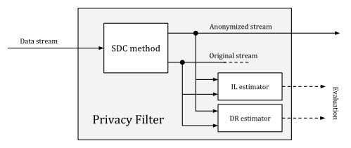
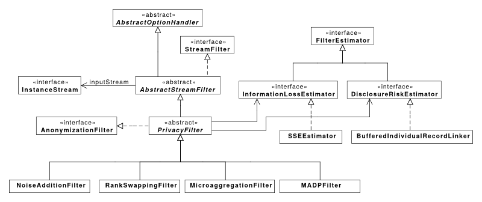
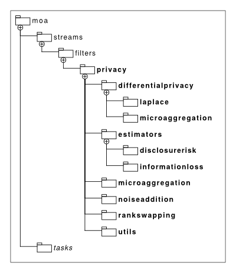

# MOA Privacy Preserving Stream Mining (moa-ppsm)

**This project currently lacks a maintainer. If you would like to take care of it, please get in touch! (or fork it and do what you wish! It's FOSS!)**

> **Table of Contents:**
>  1. [Installation](#installation)
>  2. [Privacy Filters](#privacy-filters)
>  3. [Usage](#usage)
>  4. [License](#license)

The **privacy filters** available in this [MOA](http://moa.cms.waikato.ac.nz/) extension are meant to enable data protection against information disclosure, by applying some well known [Statistical Disclosure Control](https://gss.civilservice.gov.uk/statistics/methodology-2/statistical-disclosure-control/) (SDC) methods.

This project is the result of my [Bachelor Degree Thesis](http://upcommons.upc.edu/handle/2099.1/25966), which report is available at [UPCommons](http://upcommons.upc.edu/bitstream/handle/2099.1/25966/106028.pdf?sequence=1). The report covers in much more detail the design of the filters provided in this library, along with some benchmark results regarding their *disclosure risk* and *information loss* performance.

## Installation

To install this library, you will need [Maven](https://maven.apache.org/). Once you have it installed, move to the root directory of this project, where the `pom.xml` file is located and run the command:

```bash
mvn install
```

The generated artifact JAR will be located under the created `target` directory.

## Privacy Filters

All `PrivacyFilter`s output a pair of original and anonymized instance streams, to allow the later evaluation of disclosure risk (DR) and information loss (IL) using estimators. The following schematic explains how the filters work:



The design of the library enables easy extensibility, plugging in new SDC methods or more advanced DR/IL estimators as needed.

Four `PrivacyFilter`s are available, adapting well known SDC methods to the *stream mining* environment for which MOA was built for:

* `NoiseAdditionFilter`: the simplest of the filters, adds random gaussian noise to the data being streamed.
* `RankSwappingFilter`:
* `MicroaggregationFilter`:
* `DifferentialPrivacyFilter`:

The following (incomplete) diagram illustrates the structure of the filters classes:



These classes are organized in packages, easing the extensibility and readability of the code base as follows:



## Usage

In a sandbox project directory, assuming that you have the [necessary artifacts](http://moa.cms.waikato.ac.nz/getting-started/) to run MOA under a `lib` folder, the following Bash script can ease the use of MOA to execute one of the `moa-ppsm` tasks.

```bash
#! /bin/bash

# run MOA with the necessary libraries in the Java classpath
PPSM_JAR=./lib/moa-ppsm.jar
MOA_JAR=./lib/moa.jar
AGENT_JAR=./lib/sizeofag.jar

java -cp $MOA_JAR:$PPSM_JAR -javaagent:$AGENT_JAR moa.DoTask "$@"
```

For example, if the previous script was called `moa.sh`, to *anonymize* a randomly generated stream, you could execute:

```bash
./moa.sh "Anonymize -s (generators.WaveformGenerator) -f (differentialprivacy.DifferentialPrivacyFilter -k 100
    -e 100 -b 1000) -O report.moa -m 100000"
```

The `WaveformGenerator` would stream random instances through the `DifferentialPrivacyFilter`, which runtime parameters are: *cluster size* (`k`): 100, *epsilon* (`e`) 1.0 and *buffer size* (`b`) 1000. The anonymization report would be written to `report.moa` and a maximum of 100000 instances would be processed.

## License

```
The MIT License (MIT)

Copyright (c) 2015 David Martínez Rodríguez

Permission is hereby granted, free of charge, to any person obtaining a copy
of this software and associated documentation files (the "Software"), to deal
in the Software without restriction, including without limitation the rights
to use, copy, modify, merge, publish, distribute, sublicense, and/or sell
copies of the Software, and to permit persons to whom the Software is
furnished to do so, subject to the following conditions:

The above copyright notice and this permission notice shall be included in
all copies or substantial portions of the Software.

THE SOFTWARE IS PROVIDED "AS IS", WITHOUT WARRANTY OF ANY KIND, EXPRESS OR
IMPLIED, INCLUDING BUT NOT LIMITED TO THE WARRANTIES OF MERCHANTABILITY,
FITNESS FOR A PARTICULAR PURPOSE AND NONINFRINGEMENT. IN NO EVENT SHALL THE
AUTHORS OR COPYRIGHT HOLDERS BE LIABLE FOR ANY CLAIM, DAMAGES OR OTHER
LIABILITY, WHETHER IN AN ACTION OF CONTRACT, TORT OR OTHERWISE, ARISING FROM,
OUT OF OR IN CONNECTION WITH THE SOFTWARE OR THE USE OR OTHER DEALINGS IN
THE SOFTWARE.
```
